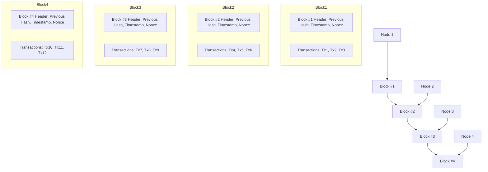

# Block chain

```mermaid {theme: 'neutral', scale: 0.4}
graph TB
    A[Block #1] --> B[Block #2]
    B --> C[Block #3]
    C --> D[Block #4]
    
    subgraph Block1
        A1[Block #1 Header: Previous Hash, Timestamp, Nonce]
        A2[Transactions: Tx1, Tx2, Tx3]
    end
    
    subgraph Block2
        B1[Block #2 Header: Previous Hash, Timestamp, Nonce]
        B2[Transactions: Tx4, Tx5, Tx6]
    end
    
    subgraph Block3
        C1[Block #3 Header: Previous Hash, Timestamp, Nonce]
        C2[Transactions: Tx7, Tx8, Tx9]
    end
    
    subgraph Block4
        D1[Block #4 Header: Previous Hash, Timestamp, Nonce]
        D2[Transactions: Tx10, Tx11, Tx12]
    end

    NodeA[Node 1] --> A
    NodeB[Node 2] --> B
    NodeC[Node 3] --> C
    NodeD[Node 4] --> D

```