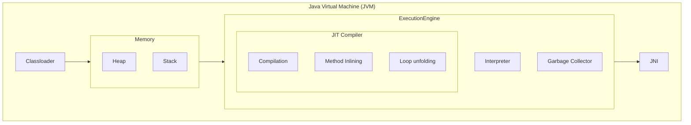

# JVM Architecture

```mermaid {theme: 'neutral', scale: 0.4}
graph TB;
  subgraph "Java Virtual Machine (JVM)"
    classloader[Classloader]
    subgraph Memory
        heap[Heap]
        stack[Stack]
    end

    subgraph "ExecutionEngine"
      interpreter[Interpreter]
      subgraph "JIT Compiler"
        compile["Compilation"]
        inline["Method Inlining"]
        loopfold["Loop unfolding"]
      end
      gc[Garbage Collector]
    end
    jni[JNI]
  end


  classloader --> Memory

  Memory --> ExecutionEngine
  ExecutionEngine --> jni

```