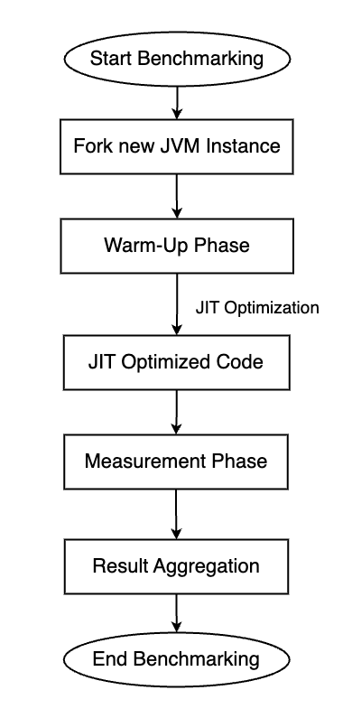
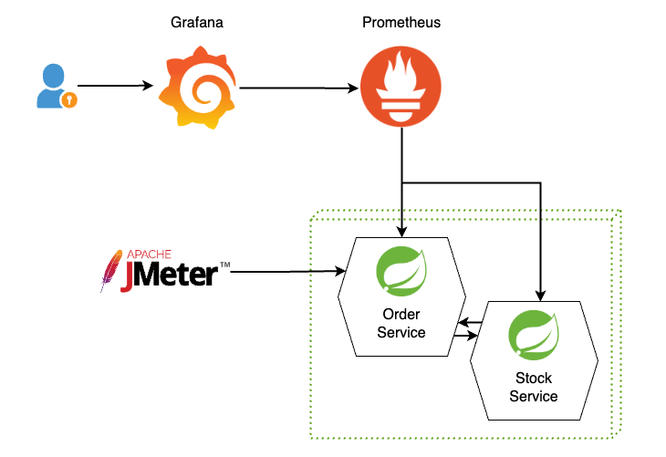
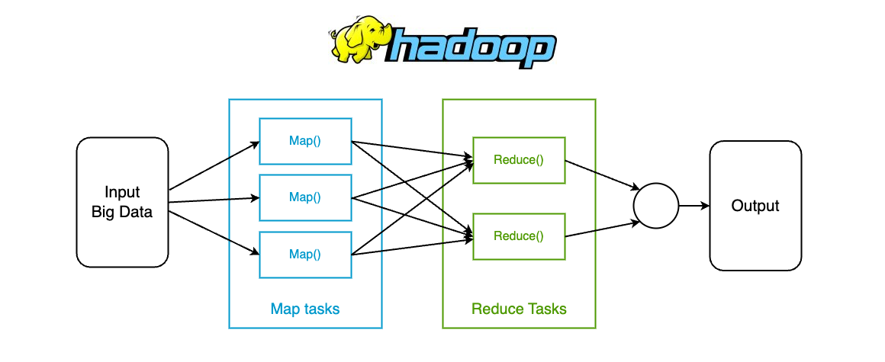
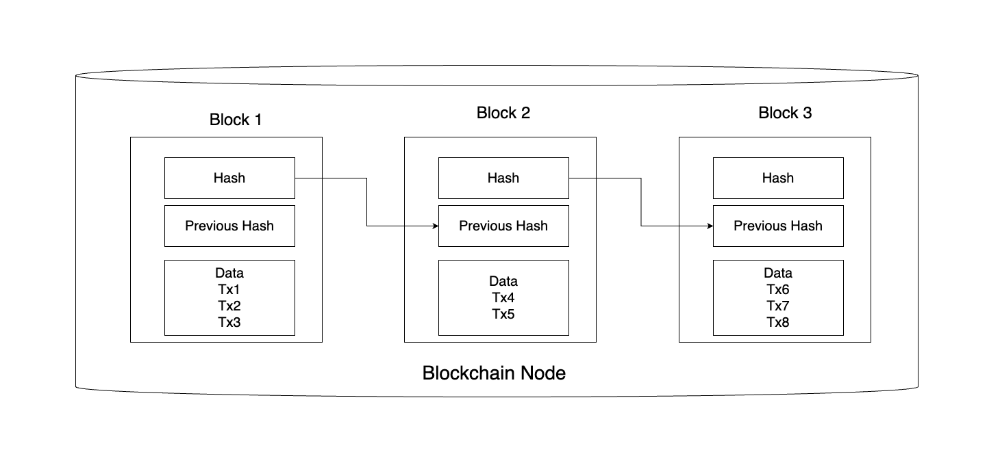
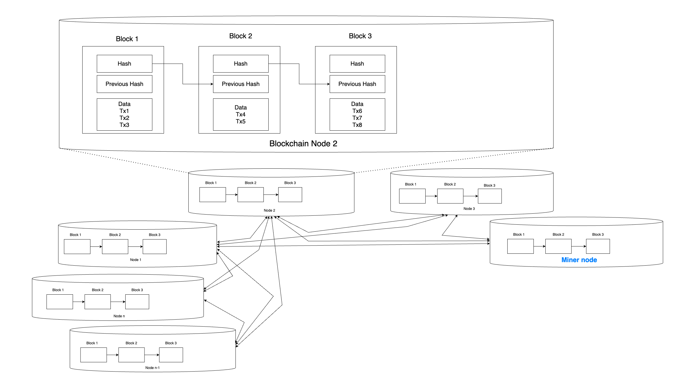
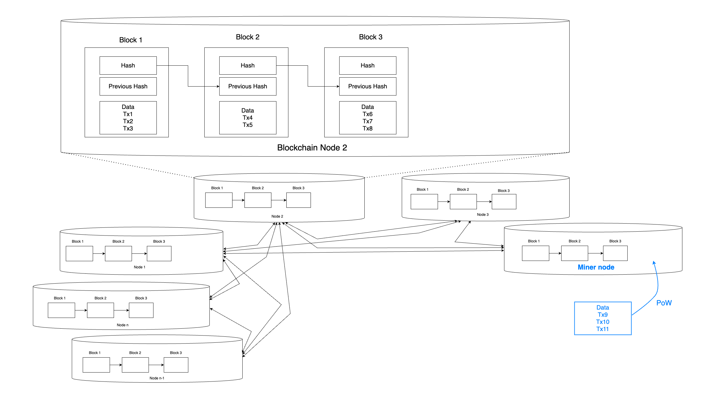
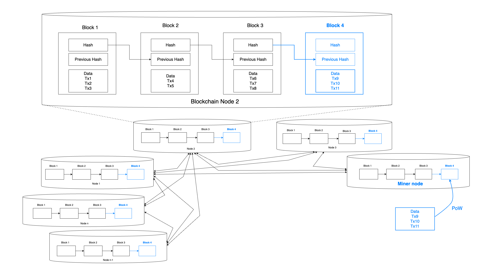
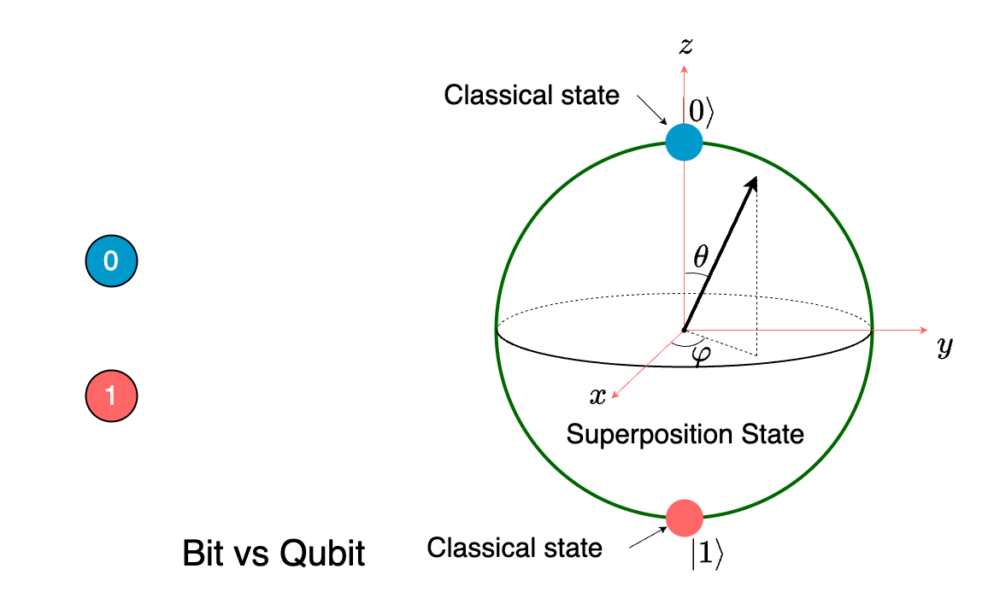
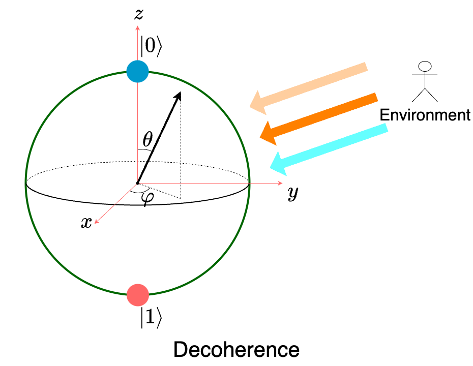
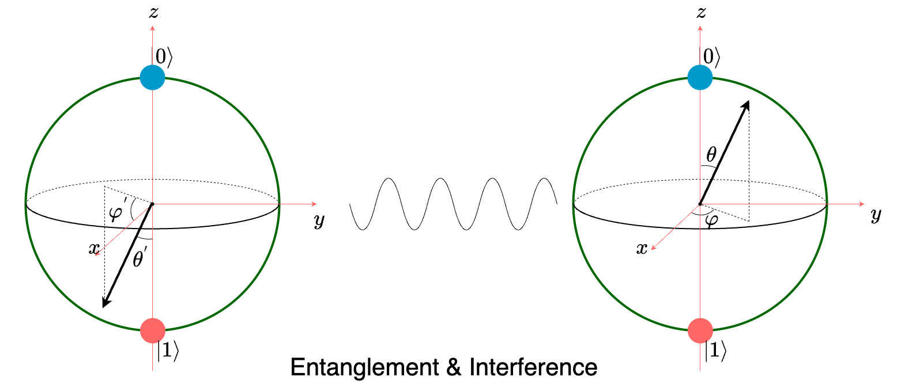

# Performance Tracking and Optimization

From JVM to Distributed Systems 

  
    <carbon:arrow-right class="inline"/>
  

---
transition: slide-left
---

# About me

Dipl.-Ing. Ardit Ymeri 

{ style="width: 35%"}

 <ul>
  <li>Senior Software Engineer at OpenValue </li>
  <li>Studied Logic and Computation at TU Wien </li>
  <li>Studied Computer Engineering at UPT Tirana </li>
  <li>Moved to Vienna  in 2013</li>
 </ul>

 

  
  
  
  

<!-- Find some pictures of me: 

  - summer pictures 
  - cycling pictures 
  - swimming pictures 
  - guitar picture 

 -->

<!-- 

- I work as consultant on insurance companies on behalf of Open Value. 

- I moved from albania to austria in 2013 because I wanted to study Logic and Computer Science 
at Vienna University of Technology. That's the reason I'm here now. 

- It's funny how you put enormous efforts on studying Logic and all theorems about computability theory 
only to end up working as a software developer in a financial institution .... because that's where the money is. 

I hope my boss doesn't hear that :D 

The reason why i'm saying this is I will mention a few tools today. I'm not working for any of them nor trying to promote any of them. 

In the past tho, I did spend some years working on Java refactoring tools.
And because of that, i had to dig deeper in the Java features and understand the language and its tools closely. 

-->

---
transition: fade-out
layout: center
level: 1
---

# Java Optimization

---
transition: fade-out
layout: two-cols
layoutClass: gap-16
src: ./pages/string-concatenation-invokedynamic.md
level: 2
---

---
transition: fade-out
src: ./pages/measure-execution-time.md
level: 2

---

---
transition: fade-out
src: ./pages/jvm-architecture.md
level: 2
---

---
transition: fade-out
level: 2
---

# Java Microbenchmark Harness JMH 
A tool for accurate performance measurement in Java

Purpose: 
* Measure performance for (small) code snippets

Why use JMH for Benchmarking?
* consider JVM optimizations 
* warmup effects
* reliable, reproducible performance results

{class="mx-auto block" style="width: 45%"}

---
transition: fade-out
src: ./pages/jmh-loop-vs-stream-code.md
level: 2
---

---
transition: fade-out
level: 2
src: ./pages/jmh-loop-vs-stream.md
---

---
transition: fade-out
layout: image-right
image: "./media/profiling-background.webp"
level: 2
---

# Profiling 
Analyze the runtime behavior of an application

Why use profilers
* identify bottlenecks in the code 
* understand memory allocation and GC
* gain insights into thread synchronization 

Popular profilers
* JMC and Flight recorder
* IntelliJ Profiler
* VisualVM
* YourKit
* JProfiler 
* ...

---
transition: fade-out
level: 2
src: ./pages/profiling-out-of-memory.md
---

---
transition: fade-out
layout: center
class: text-left
level: 1
---

# Distributed Services

---
transition: fade-out
level: 1
---

# Performance Tracking in Distributed Environments 

 

{class="mx-auto block" style="width: 55%"}

<!-- -->

---
transition: fade-out
level: 2
---

# JMeter 

 

  {class="mx-auto block"}

  {class="mx-auto block"}

  

<!-- -->

---
transition: fade-out
level: 2
---

# Prometheus 

 

  {class="mx-auto block"}

{class="mx-auto block"}

  

<!-- -->

---
transition: slide-left
level: 2
---

# Grafana 

 

{class="mx-auto block"}

<!-- -->

---
transition: fade-out
layout: center
level: 1
---

# The Nature of Problems 

---
transition: fade-out
level: 2
---

# The Nature of Problems (1/3) 

Algorithmic Optimization Problems  - Improve efficiency of algorithms 

Profiling 

  
 

  {class="mx-auto block"}

  

  
 

  {class="mx-auto block"}

  

  
 
  
  {class="mx-auto block"}
  
  

  

  .png){class="mx-auto block" style="width: 70%"}
  
  

  

 {class="mx-auto block" style="width: 70%"}
 

  

Benchmarking & Monitoring

 

 {class="mx-auto block" style="width: 60%"}

 

 {class="mx-auto block" style="width: 70%"}

<!-- -->

---
transition: fade-out
level: 2
---

# The Nature of Problems (2/3) 
Data-intensive problems 

* Split the work into multiple machines 
* Combine the result 

{class="mx-auto block" style="width: 70%"}

<!-- -->

---
transition: slide-left
level: 2
---

# The Nature of Problems (3/3) 
Combinatorial/Exponential Search Problems - Complexity Theory: NP 

* Easy to guess and check 
* Enormous search space 

Examples: 
- Routing problems 
- Graph theory 
- ...

Applications: 
- Logistics 
- Cryptography 
- Blockchain and cryptocurrency 
- ...

<!--

Then we have Combinatorial or exponential search problems 
Searching is generally something trivial implement - guess and check procedure
The difficult part stands on the search space. 
If the search space grows exponentially with the size of the input, then soon it becomes practically impossible to iterate the entire search space

 -->

---
transition: fade-out
level: 1
layout: center
---

# Blockchain Concepts

---
transition: fade-out
level: 1
---

# Blockchain - Node

  

{class="mx-auto block" style="width: 90%"}

<!-- -->

---
transition: slide-out
level: 1
---

# Blockchain Decentralized

{class="mx-auto block" style="width: 90%"}

---
transition: slide-out
level: 1
---

# Blockchain Decentralized

{class="mx-auto block" style="width: 90%"}

---
transition: slide-left
level: 1
---

# Blockchain Decentralized

{class="mx-auto block" style="width: 90%"}

<!-- -->

---
transition: fade-out
level: 1
layout: center
---

# Quantum Computing

---
transition: fade-out
level: 1
---

# Quantum Computing - Fundamentals 

{class="mx-auto block" style="width: 67%"}

{class="mx-auto block" style="width: 52%"}

{class="mx-auto block" style="width: 50%"}

<!-- 

When it comes to quantum computing, the fundamental unit of information is a Qubit. Which is analogous to the bits in classical computing, but it has some substantial differences. 

Understanding the differences requires some basic understanding of four key principles of quantum mechanics. 

Superposition - While classical bits can exists in either of two states - typically represented by 0 and 1, a Qubit can also be in a superposition of both states. 
Superposition is the state in which a quantum particle or system can represent not just one possibility, but a combination of multiple possibilities that can be expressed with probability magnitudes. 

Decoherence -  Decoherence is the process in which quantum particles and systems can decay, collapse or change, converting into single states measurable by classical physics.  

Entanglement - Entanglement is the process in which multiple quantum particles become correlated more strongly than regular probability allows.

Interference - Interference is the phenomenon in which entangled quantum states can interact and produce more and less likely probabilities.

Qubits

A qubit can behave like a bit and store either a zero or a one, but it can also be a weighted combination of zero and one at the same time. 
When combined, qubits in superposition can scale exponentially. 
Two qubits can compute with four pieces of information, three can compute with eight, and four can compute with sixteen.

However, each qubit can only output a single bit of information at the end of the computation. 
Quantum algorithms work by storing and manipulating information in a way inaccessible to classical computers, which can provide speedups for certain problems.

Generally, qubits are created by manipulating and measuring quantum particles (the smallest known building blocks of the physical universe), such as photons, electrons, trapped ions and atoms. 
Qubits can also engineer systems that behave like a quantum particle, as in superconducting circuits.

How the principles work together

To better understand quantum computing, consider that two counterintuitive ideas can both be true. The first is that objects that can be measured—qubits in superposition with defined probability amplitudes—behave randomly. The second is that objects too distant to influence each other—entangled qubits—can still behave in ways that, though individually random, are somehow strongly correlated. 

A computation on a quantum computer works by preparing a superposition of computational states. 
A quantum circuit, prepared by the user, uses operations to generate entanglement, leading to interference between these different states, as governed by an algorithm. 
Many possible outcomes are canceled out through interference, while others are amplified. 
The amplified outcomes are the solutions to the computation.

-->

<!-- 

There is a lot of enthusiasm out there about quantum computing and the advantages it can bring. 

Without going too much into details on the fundamental concepts of quantum computing, I think, it is important to understand that the vast majority of programs will continue running on 'classical' computers, as we know them. 

To take advantage of quantum computers, we have to formulate the problems randomized algorithms that can exploit the powerful advantage of quantum bits compared to classical bits. 

For example, factorizing a composed number into prime numbers is a problem that is considered difficult to solve with traditional computers, but there is already a known algorithm called 'Shor's' algorithm that can take advantage of quantum computing. 

Other areas that can take advantage of quantum computing are material engineering, pharmaceutics, quantum simulators, etc.. 
It turns out, that it is much easier to simulate particle behaviors using quantum computers rather than using classical computers. 

 -->
---
transition: slide-left
level: 1
---

# Quantum computing - Applications

- Quantum simulation 
- Cryptography 
- Chemistry 
- Material and drug production 
- Machine learning
- ... 

<!-- 

When is quantum computing superior?

For most kinds of tasks and challenges, traditional computers are expected to remain the best solution. 
But when scientists and engineers encounter certain very complex problems, that’s where quantum comes into play.
For these types of difficult calculations, even the most powerful supercomputers (big machines with thousands of traditional cores and processors) pale in comparison to quantum computing’s power. 
That’s because even supercomputers are binary code-based machines reliant on 20th-century transistor technology. 
Classical computers are simply unable to process such complex problems.

Complex problems are problems with lots of variables interacting in complicated ways. Modeling the behavior of individual atoms in a molecule is a complex problem, because of all the different electrons interacting with one another. Identifying new physics in a supercollider is also a complex problem. There are some complex problems that we do not know how to solve with classical computers at any scale.

A classical computer might be great at difficult tasks like sorting through a big database of molecules. 
But it struggles to solve more complex problems, like simulating how those molecules behave. 
Today, if scientists want to know how a molecule will behave, they must synthesize it and experiment with it in the real world. 
If they want to know how a slight tweak would impact its behavior, they usually need to synthesize the new version and run their experiment all over again. 
This is an expensive, time-consuming process that impedes progress in fields as diverse as medicine and semiconductor design.

A classical supercomputer might try to simulate molecular behavior with brute force, by using its many processors to explore every possible way every part of the molecule might behave. But as it moves past the simplest, most straightforward molecules available, the supercomputer stalls. 
No computer has the working memory to handle all the possible permutations of molecular behavior by using any known methods.

Quantum algorithms take a new approach to these sorts of complex problems—creating multidimensional computational spaces or running calculations that behave much like these molecules themselves. 
This turns out to be a much more efficient way of solving complex problems like chemical simulations. 

Engineering firms, financial institutions and global shipping companies—among others—are exploring use cases where quantum computers could solve important problems in their fields. 
An explosion of benefits from quantum research and development is taking shape on the horizon. 
As quantum hardware scales and quantum algorithms advance, many big, important problems like molecular simulation should find solutions.

Quantum computing use cases

First theorized in the early 1980s, it wasn’t until 1994 that MIT mathematician Peter Shor published one of the first practical real-world applications for a quantum machine. 
Shor’s algorithm for integer factorization demonstrated how a quantum mechanical computer could potentially break the most advanced cryptography systems of the time—some of which are still used today. 
Shor’s findings demonstrated a viable application for quantum systems, with dramatic implications for not just cybersecurity, but many other fields. 

Quantum computers excel at solving certain complex problems with the potential to speed up the processing of large-scale data sets. 
From the development of new drugs and performing machine learning in a new way to supply-chain optimization and climate change challenges, quantum computing might hold the key to breakthroughs in a number of critical industries.

Pharmaceuticals
Quantum computers capable of simulating molecular behavior and biochemical reactions could massively speed up the research and development of life-saving new drugs and medical treatments. 

Chemistry
For the same reasons quantum computers could impact medical research, they might also provide undiscovered solutions for mitigating dangerous or destructive chemical byproducts. 
Quantum computing could lead to improved catalysts that enable petrochemical alternatives or better processes for the carbon breakdown necessary for combating climate-threatening emissions. 

Machine learning
As interest and investment in artificial intelligence (AI) and related fields like machine learning ramps up, researchers are pushing AI models to new extremes, testing the limits of our existing hardware and demanding tremendous energy consumption. 
There is evidence that some quantum algorithms might be able to look at datasets in a new way, providing a speedup for some machine learning problems.

-->

---
transition: slide-left
level: 1
---

# Take Away  
- Know your tools: sometimes they help optimizing performance 
- Identify the pain-points first. Then try to eliminate them 
- In distributed systems this is easier said then done 
- Complex problems - practically infinite time complexity 
- Looking forward to Quantum 

---
layout: center
class: text-left
---

# Resources

[Documentation](https://sli.dev) · [GitHub](https://github.com/slidevjs/slidev) 

 
 

# Thank you 

<PoweredBySlidev mt-10 />
