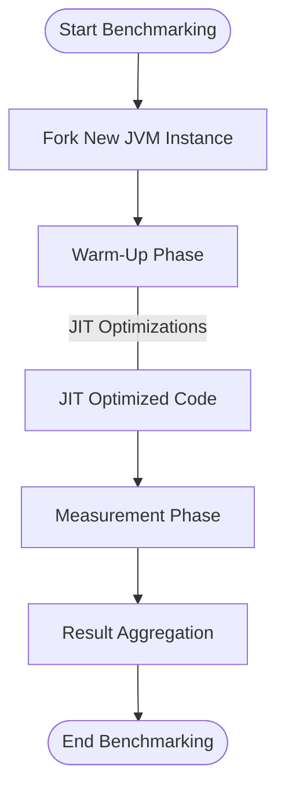

# Performance tracking and optimization

From JVM to distributed systems 

<div class="pt-12">
  <span @click="$slidev.nav.next" class="px-2 py-1 rounded cursor-pointer" hover="bg-white bg-opacity-10">
    <carbon:arrow-right class="inline"/>
  </span>
</div>

---
transition: slide-up
layout: center
---

# About me

Ardit Ymeri 

<!-- Find some pictures of me: 

  - summer pictures 
  - cycling pictures 
  - swimming pictures 
  - guitar picture 


 -->

<!-- 

- I work as consultant on insurance companies on behalf of Open Value. 

- I moved from albania to austria in 2013 because I wanted to study Logic and Computer Science 
at Vienna University of Technology. That's the reason I'm here now. 

- It's funny how you put enormous efforts on studying Logic and all theorems about computability theory 
only to end up working as a software developer in a financial institution .... because that's where the money is. 

I hope my boss doesn't hear that :D 

The reason why i'm saying this is I will mention a few tools today. I'm not working for any of them nor trying to promote any of them. 

In the past tho, I did spend some years working on Java refactoring tools.
And because of that, i had to dig deeper in the Java features and understand the language and its tools closely. 

-->

---
transition: slide-left
layout: center
level: 1
---

# Java Optimization

---
transition: fade-out
src: ./pages/string-literals.md
level: 2
---


---
transition: fade-out
layout: two-cols
layoutClass: gap-16
src: ./pages/string-concatenation-invokedynamic.md
level: 2
---


---
transition: fade-out
src: ./pages/measure-execution-time.md
level: 2

---


---
transition: fade-out
src: ./pages/jvm-architecture.md
level: 2
layout: center
class: text-center
---


---
transition: fade-out
level: 2
---

# Java Microbenchmark Harness JMH 
A Tool for Accurate Performance Measurement in Java

<div grid="~ cols-2 gap-60">

<div>


Purpose: 
* Measure performance for (small) code snippets

Why Use JMH
* consider JVM optimizations when benchmarking 
* warmup effects
* reliable, reproducible performance results
</div>

<div>



</div>
</div>

---
transition: fade-out
level: 2
---

# JMH Examples - Loops vs Streams

```java
import org.openjdk.jmh.annotations.*;

@State(Scope.Thread)
public class SumBenchmark {

    private List<Integer> numbers;

    @Setup(Level.Trial)
    public void setup() {
        numbers = IntStream.range(1, 1_000_000).boxed().toList();
    }

    @Benchmark
    @BenchmarkMode(Mode.AverageTime)
    @OutputTimeUnit(TimeUnit.MILLISECONDS)
    public int sumUsingForLoop() {
        int sum = 0;
        for (int num : numbers) 
          sum += num;
        return sum;
    }
}

```

---
transition: fade-out
level: 2
---

# JMH Examples - Lambda vs Method Reference

```java
@Benchmark
@BenchmarkMode(Mode.AverageTime)
@OutputTimeUnit(TimeUnit.MILLISECONDS)
public List<String> convertToUppercaseUsingLambda() {
    return strings.stream()
            .map(s -> s.toUpperCase())
            .collect(Collectors.toList());
}

@Benchmark
@BenchmarkMode(Mode.AverageTime)
@OutputTimeUnit(TimeUnit.MILLISECONDS)
public List<String> convertToUppercaseUsingMethodReference() {
    return strings.stream()
            .map(String::toUpperCase)
            .collect(Collectors.toList());
}

```

---
transition: fade-out
level: 2
---

# JMH Diagrams 

Put some diagrams after running benchmarks

Diagram here

---
transition: fade-out
level: 2
---

# Profiling 
Analyze runtime behavior of an application

Why use profilers
* identify bottlenecks in the code 
* understand memory allocation and GC patterns
* gain insights into thread synchronization issues 

Popular profilers
* VisualVM
* YourKit
* JProfiler 
* Perf

---
transition: fade-out
level: 2
---

# Example - Profiling


---
transition: fade-out
level: 2
---

# Example - Project loom

---
transition: fade-out
level: 2
src: ./pages/graalvm.md
hide: false
---


---
transition: fade-out
level: 1
---

# Performance Tracking in Distributed environments 


---
transition: fade-out
level: 2
---

# JMeter 

---
transition: fade-out
level: 2
---

# JMeter Example 


---
transition: fade-out
level: 1
---

# Nature of the problems 


---
transition: fade-out
level: 1
---

# Nature of the problems - examples

---
transition: fade-out
level: 1
---

# Decentralized 

---
transition: fade-out
level: 1
src: ./pages/block-chain-diagram.md
hide: false
---


---
transition: fade-out
level: 1
---

# Quantum computing  


---
transition: fade-out
level: 1
---

# Quantum computing - Where we are


---
transition: fade-out
level: 1
---

# Quantum computing - what we expect 


---
transition: fade-out
level: 1
---

# Take Away  
- Know the tools: sometimes they help optimizing performance 
- Identify the pain-points first. Then try to eliminate them 
- In distributed systems this is easier said then done 
- Complex problems - practically infinite time complexity 
- Looking forward to Quantum 


---
layout: center
class: text-center
---

# Resources

[Documentation](https://sli.dev) · [GitHub](https://github.com/slidevjs/slidev) · [Showcases](https://sli.dev/resources/showcases)

# Thank you 

<PoweredBySlidev mt-10 />
